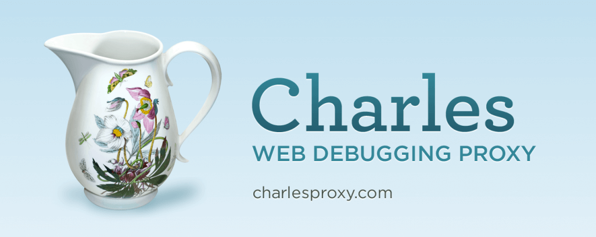
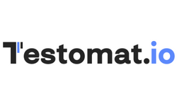
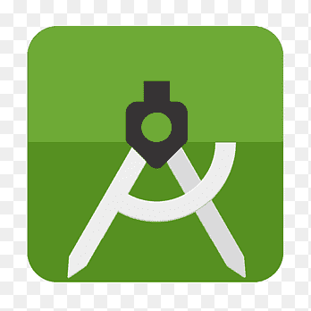
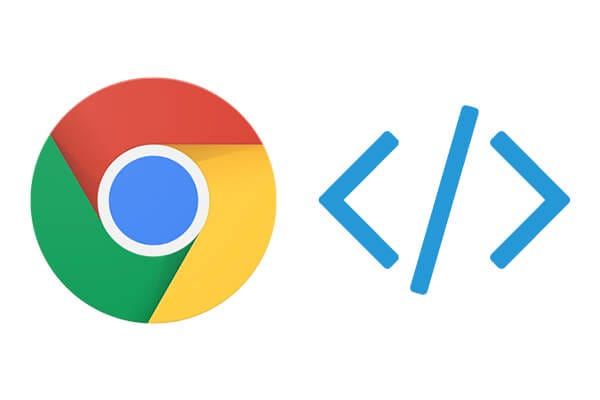

<h1 align="center">👋 Hi, I'm Alyona Stolyarenko — QA Engineer!</h1>

  
  
  

---

## 🧪 About Me

As a Quality Assurance Engineer, I test web and mobile applications end-to-end:
- Report clear & structured **Bug Reports**
- Create comprehensive **Test Cases**, **Checklists**, **RTMs**, **Test Suites**
- Compile insightful **Test Reports**
- Thrive in **Agile/SCRUM** team environments

---

## 🛠️ Skills & Tools

  
  
  
  
  
  
  
  
  
  
  
  
  
  

### 🔍 API & Network Testing  
- Postman   
- Charles Proxy / Fiddler  

### 🧪 Test Management  
- Jira 
- TestRail  
- TestomatIO 
- Qase  

### 🧰 Version Control  
- Git, GitHub, Git Bash  

### 📱 Mobile Testing  
- Android Studio, Genymotion  

### ⚙️ Performance Testing  
- JMeter  

### 🛠️ Web Debugging  
- Browser DevTools  

## 🧠 Fundamentals

- HTML / CSS / JavaScript (basic)
- STLC / SDLC
- Agile / SCRUM methodologies

---

## 📊 GitHub Stats

  
  &nbsp;&nbsp;
  

---

## 📬 Contact

- 📧 Email: `estolarenko5@gmail.com`  
- 💼 LinkedIn: [https://www.linkedin.com/in/alyona-stolyarenko-qa/](https://www.linkedin.com/in/alyona-stolyarenko-qa/)  
- 💬 Telegram: [@a_stolyarenko13](https://t.me/a_stolyarenko13)

Let’s build high‑quality products together! 🚀

