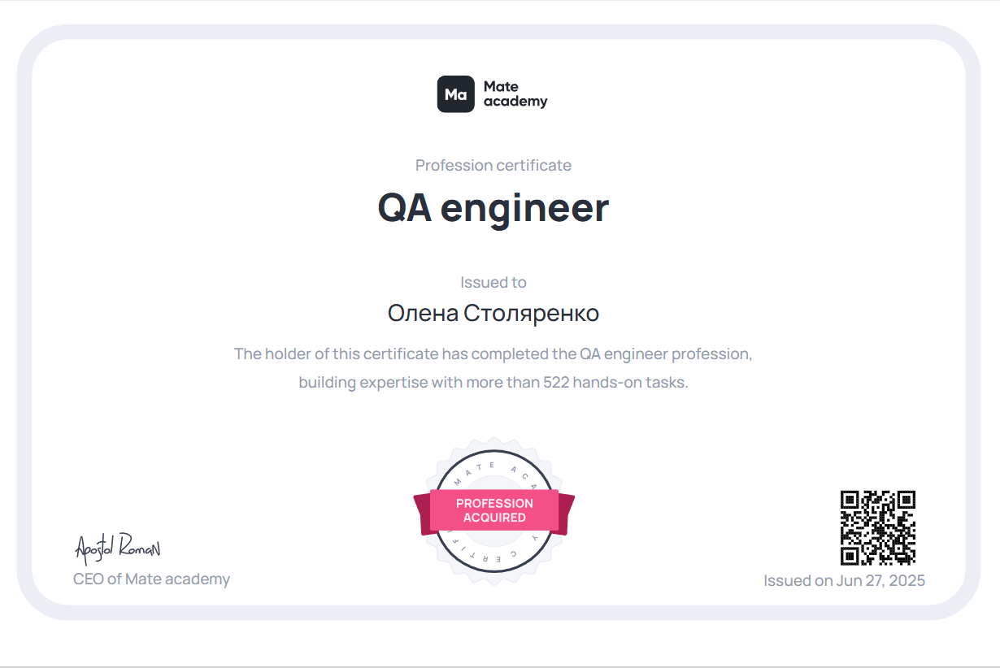
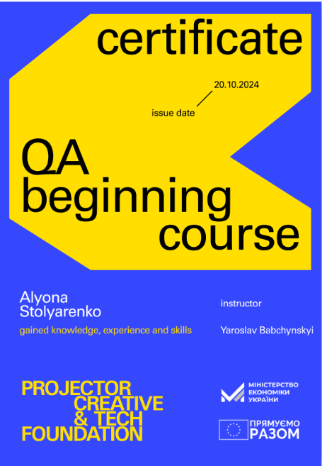

<h1 align="center">👋 I'm Alyona — Manual QA Engineer</h1>

<strong>Web 🌠+ Mobile 📱 | Agile 🚀 | API 🔌</strong>

  

  
  
  

  

---

## 📚 Table of Contents
- [About Me](#-about-me)
- [Skills & Tools](#️-skills--tools)
- [Fundamentals](#-fundamentals)
- [Education & Certifications](#-education--certifications)
- [GitHub Stats](#-github-stats)
- [Contact](#-contact)

---

## 🧪 About Me

As a Quality Assurance Engineer, I test web and mobile applications end-to-end:
- Report clear & structured **Bug Reports**
- Create comprehensive **Test Cases**, **Checklists**, **RTMs**, **Test Suites**
- Compile insightful **Test Reports**
- Thrive in **Agile/SCRUM** team environments

---

## 🛠️ Skills & Tools

  
  
  
  
  
  
  
  
  
  
  
  
  

### 🔍 API & Network Testing
- Postman
- Charles Proxy / Fiddler

### 🧪 Test Management
- Jira
- TestRail
- TestomatIO
- Qase

### 🧰 Version Control
- Git, GitHub, Git Bash

### 📱 Mobile Testing
- Android Studio, Genymotion

### ⚙️ Performance Testing
- JMeter

### 🛠️ Web Debugging
- Browser DevTools

---

## 🧠 Fundamentals

- HTML / CSS / JavaScript (basic)
- STLC / SDLC
- Agile / SCRUM methodologies

---

## 🎓 Education & Certifications

### 🏫 Courses

  
  
  

<ul>
  <li><a href="https://mate.academy/">QA Manual Course @ Mate academy</a></li>
  <li><a href="https://prjctr.com/">QA Basics @ Projector Institute</a></li>
  <li><a href="https://nolimit.school/">QA Course @ NoLimit School</a></li>
</ul>

### 📜 Certifications
- <a href="https://badgr.com/public/assertions/68360cf35087f10962273e6f">Postman API Fundamentals Student Expert</a>
- <a href="https://www.linkedin.com/learning/certificates/182daac56b9856d4fba54c78ce287e914e26abaddfcf86ea82c7506ca5fa468e">JMeter: Performance and Load Testing</a>
- <a href="https://www.linkedin.com/learning/certificates/5e20e1c875be6fdf82e21fa4a17326df7bdf68c36d35cb4cb6c682d97e46c1b4">Chrome Web Developer Tools</a>
- <a href="https://www.linkedin.com/learning/certificates/22ae64a1d71f6f9879059a476db62fa7984a3e4db9a9cf3c16cb4fd683fe3c43">Agile Project Management with Jira Cloud (1–3)</a>
- <a href="https://www.linkedin.com/learning/certificates/f4fc2c422648b91c4f798b77a20c93816ae98e54aa88d4aa4c15b518b0e162b3">Scrum: The Basics</a>
- <a href="https://www.linkedin.com/learning/certificates/20e8aa2fda2c3b9dba7332e8ff2f0dd7e8ab1687c888e7f1873d6874a53870d9">Introduction to Web APIs</a>
- <a href="https://www.linkedin.com/learning/certificates/b5ec2f707e39e3fda1d7db3ea9ffbe5a7313b1f23844c728f8f218946ad32c0f">Networking Basics</a>
- <a href="https://cabinet.smalltalk2.me/certificates/0b4fc807">SmallTalk English Speaking Level Test</a>

---

## 📊 GitHub Stats

  
  &nbsp;&nbsp;
  

---

## 📬 Contact

- 📧 Email: `estolarenko5@gmail.com`  
- 💼 LinkedIn: [https://www.linkedin.com/in/alyona-stolyarenko-qa/](https://www.linkedin.com/in/alyona-stolyarenko-qa/)  
- 💬 Telegram: [@a_stolyarenko13](https://t.me/a_stolyarenko13)
